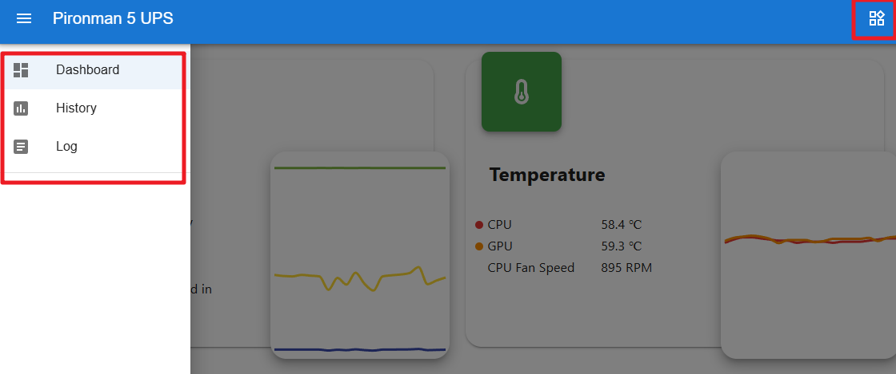
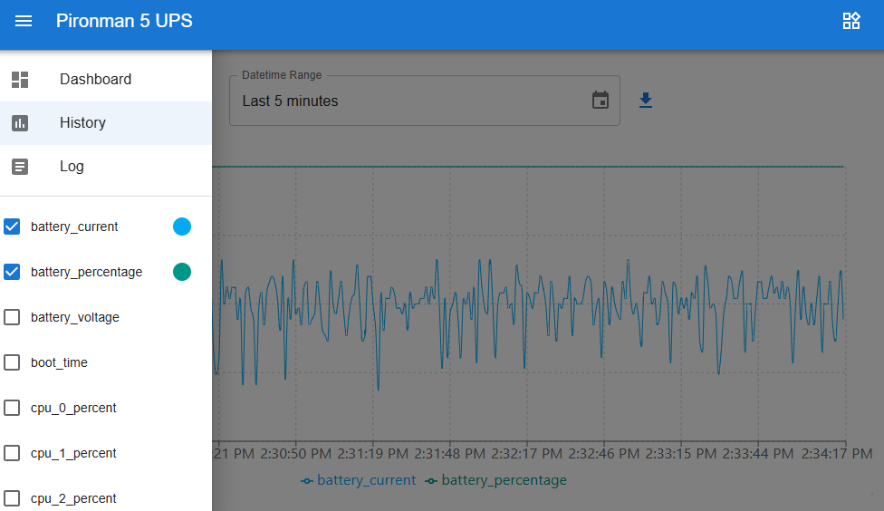
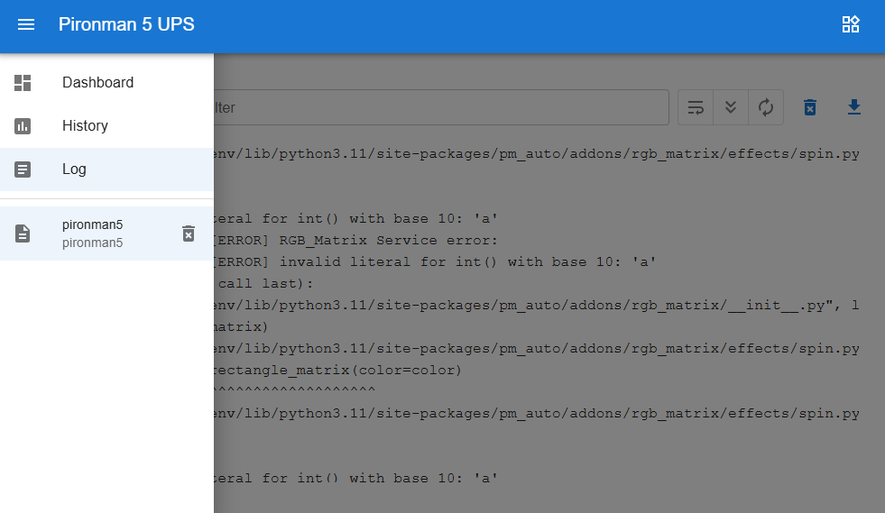
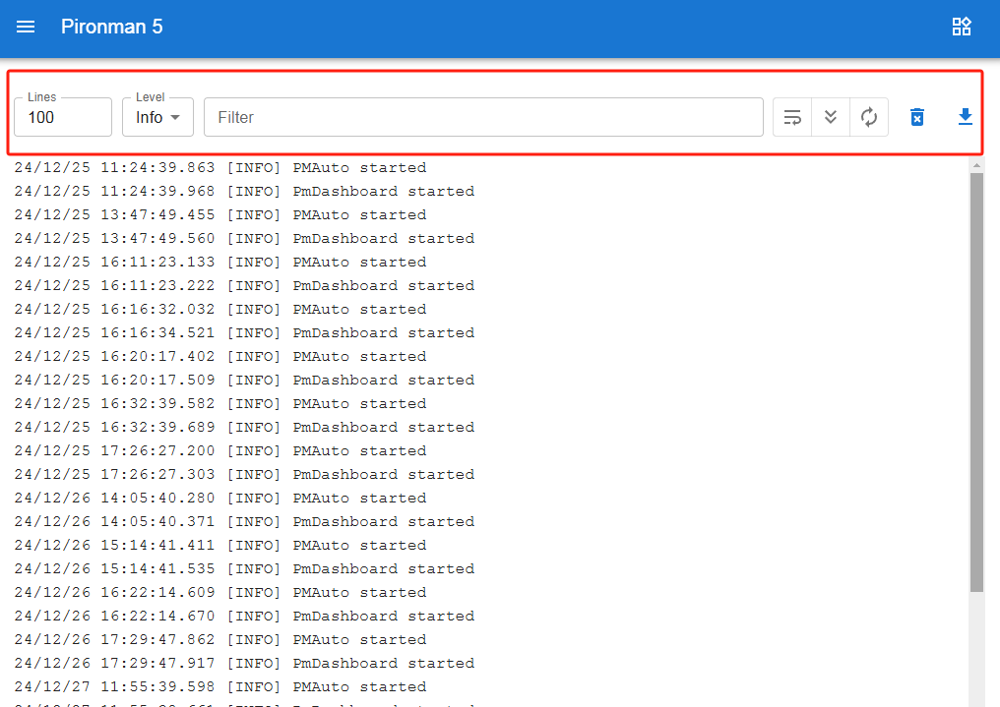
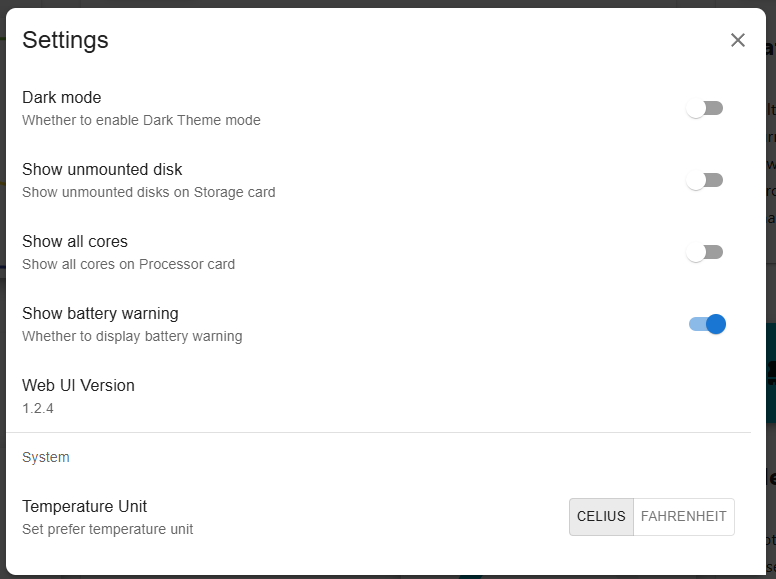
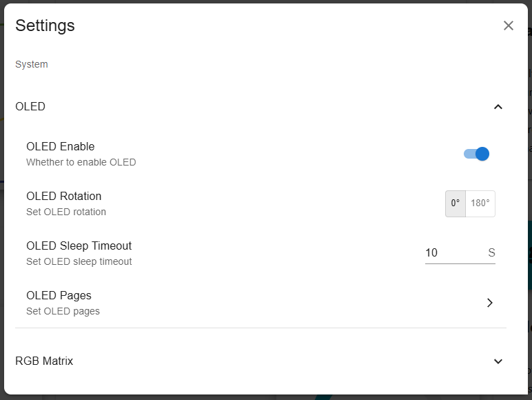
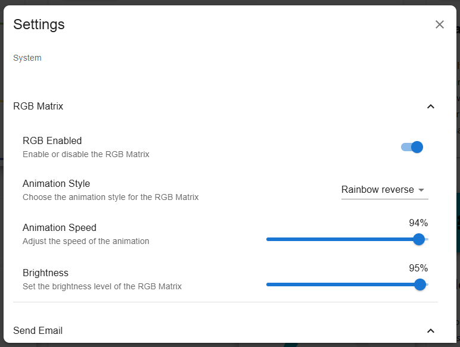
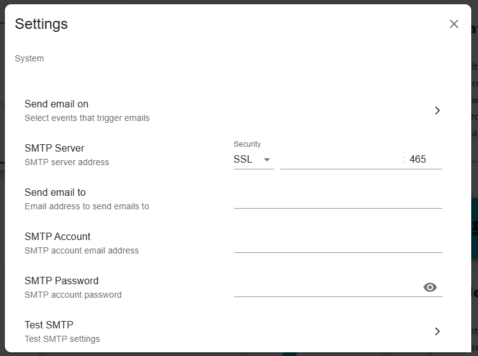
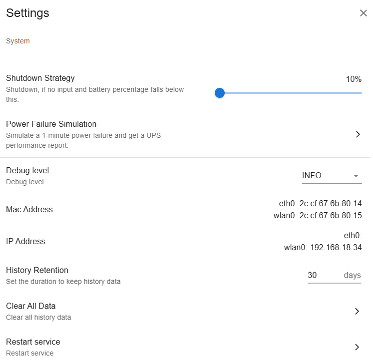

.. note::

    Hello, welcome to the SunFounder Raspberry Pi & Arduino & ESP32 Enthusiasts Community on Facebook! Dive deeper into Raspberry Pi, Arduino, and ESP32 with fellow enthusiasts.

    **Why Join?**

    - **Expert Support**: Solve post-sale issues and technical challenges with help from our community and team.
    - **Learn & Share**: Exchange tips and tutorials to enhance your skills.
    - **Exclusive Previews**: Get early access to new product announcements and sneak peeks.
    - **Special Discounts**: Enjoy exclusive discounts on our newest products.
    - **Festive Promotions and Giveaways**: Take part in giveaways and holiday promotions.

    👉 Ready to explore and create with us? Click [|link_sf_facebook|] and join today!

.. _ups_view_control_dashboard:

View and Control from Dashboard
=========================================

Once you have successfully installed the ``pironman5`` module, the ``pironman5.service`` will start automatically upon reboot.

Now you can open the monitoring page in your browser to see the information about your Raspberry Pi, configure the RGB, and control the fan, etc. The page link is: ``http://<ip>:34001``.

This page has **Dashboard**, **History**, **Log**, and a **Settings** page.

  
  
Dashboard
-----------------------

There are multiple cards to view the relevant status of the Raspberry Pi, including:

* **Input**: View the input voltage, current, and power of the Raspberry Pi.

  .. image:: img/dashboard_input.png
    :width: 90%

* **Temperature**: View the Raspberry Pi's CPU & GPU temperature and the PWM fan speed. 

  .. image:: img/dashboard_pwm_fan.png
    :width: 90%
    
* **Battery**: View the battery status of the Raspberry Pi, including the voltage, current, power, percentage, and charging status.

  .. image:: img/dashboard_battery.png
    :width: 90%

* **Raspberry Pi Power**: View the power consumption of the Raspberry Pi.

  .. image:: img/dashboard_rpi_power.png
    :width: 90%

* **Storage**: Displays the storage capacity of a Raspberry Pi, showing various disk partitions with their used and available space.

  .. image:: img/dashboard_storage.png
    :width: 90%
    

* **Memory**: Shows the Raspberry Pi's RAM usage and percentage.

  .. image:: img/dashboard_memory.png
    :width: 90%
    

* **Network**: Displays the current network connection type, upload, and download speeds.

  .. image:: img/dashboard_network.png
    :width: 90%
    

* **Processor**: Illustrates the Raspberry Pi's CPU performance, including the status of its four cores, operating frequencies, and CPU usage percentage.

  .. image:: img/dashboard_processor.png
    :width: 90%
    

History
--------------

The History page allows you to view historical data. Check the data you want to view in the left sidebar, then select the time range to see the data for that period, and you can also click to download it.

  
.. image:: img/dashboard_history2.png
  :width: 90%

Log
------------

The Log page is used to view the logs of the currently running Pironman5 service. The Pironman5 service includes multiple sub-services, each with its own log. Select the log you want to view, and you can see the log data on the right. If it is blank, it may mean there is no log content.

* Each log has a fixed size of 10MB. When it exceeds this size, a second log will be created.
* The number of logs for the same service is limited to 10. If the number exceeds this limit, the oldest log will be automatically deleted.
* There are filter tools above the log area on the right. You can select the log level, filter by keywords, and use several convenient tools, including **Line Wrap**, **Auto Scroll** and **Auto Update**.
* Logs can also be downloaded locally.

  

Settings
-----------------

There is a settings menu in the upper right corner of the page where you can customize the settings according to your preferences. After making modifications, the changes will be saved automatically. If needed, you can click the CLEAR button at the bottom to clear the historical data.

  

**Dark Mode**: Toggle between light and dark mode themes. The theme option is saved in the browser cache. Changing the browser or clearing the cache will revert to the default light theme.

**Show Unmounted Disk**: Whether to show unmounted disks in the dashboard.

**Show All Cores**: Whether to show all cores in the dashboard.

**Show Battery Warning**: Whether to show battery warning in the dashboard.

**Temperature Unit**: Set the temperature unit displayed by the system.

------------------------------------------------------

**About OLED Screen**

* **OLED Enable**: Whether to enable OLED.
* **OLED Rotation**: Set OLED rotation.
* **OLED Sleep Timeout**: Set OLED sleep timeout.

* **OLED Page**: Set OLED page. You can select and change the order of the page you want to display from the pop-up menu.

  .. image:: img/dashboard_setting_oled_page.png
      :width: 600

  * ``System Mix`` : Displays a combined overview of CPU usage, IP addresses, and temperature.
  * ``Performance Metrics`` : Shows performance metrics such as CPU, Temperature, RAM, Fan speed.
  * ``IP Address`` : Displays the current IP addresses of the Raspberry Pi.
  * ``Disk Usage`` : Shows disk usage and available storage.
  * ``Battery Status`` : Displays battery percentage, charging/discharging status, and voltage.
  * ``Input Power`` : Shows input power information.
  * ``Raspberry Pi Power`` : Displays Raspberry Pi power state.

------------------------------------------------------

**About RGB Matrix**

Some style have different parameters, such as **Rainbow** and **Dual Spin**.

* **RGB Enabled**: Whether to enable RGB Matrix.
* **Animation Style**: Set RGB Matrix animation style.
* **Primary Color**: Set RGB Matrix primary color.
* **Secondary Color**: Set RGB Matrix secondary color. (Only for some styles)
* **Speed**: Set RGB Matrix speed.
* **Brightness**: Set RGB Matrix brightness.

------------------------------------------------------

**About Send Email**

* **Send Email On**: Select events to send email. 

    Possible trigger events include:

    - ``Low Battery``
    - ``Power Disconnected``
    - ``Power Restored``
    - ``Power Insufficient``
    - ``Battery Critical Shutdown``
    - ``Battery Voltage Critical Shutdown``

* **SMTP Server**: Set SMTP server and SMTP port.
* **Send Email to**: Set email address to send email.
* **SMTP Account**: Set SMTP user.
* **SMTP Password**: Set SMTP password.
* **Test SMTP**: Test SMTP settings.

------------------------------------------------------

**Shutdown Strategy**: Shutdown, if no input and battery percentage falls below this.

**Power Failure Simuation**:  Simulate a 1-minute power failure, if no input and battery percentage falls below this. Get a UPS performance report.

**Debug Level**: Set debug level. (None, Error, Warning, Info, Debug)

**Mac Address**: Get the MAC address of the device.

**IP Address**: Get the IP address of the device.

**History Retention**: Set the number of days to keep history data.

**Clear ALL Data**: Clear all data.

**Restart service**: Restart the service.