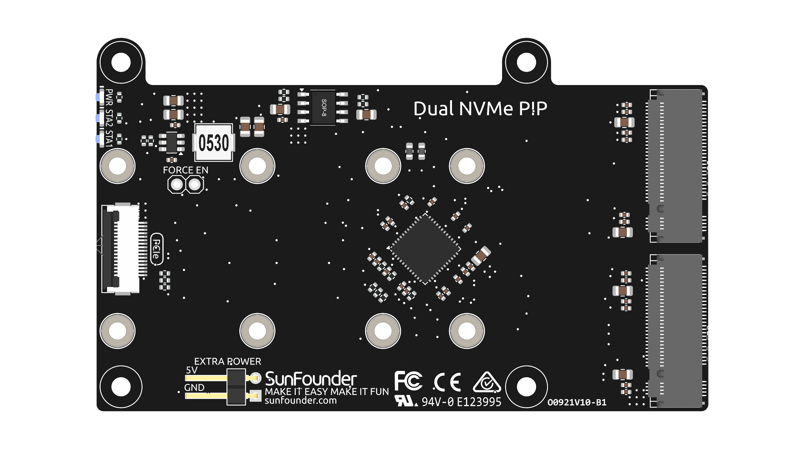
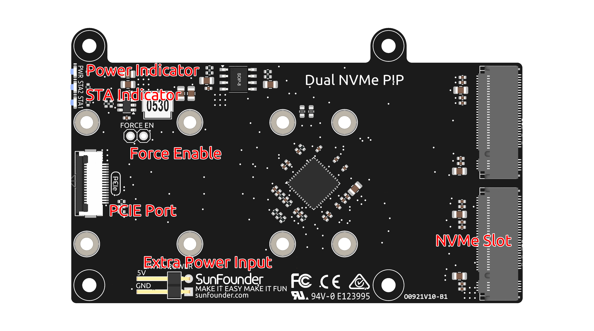

UPS Dual NVMe PIP
================================================

The **UPS Dual NVMe PIP** enables you to connect two M.2 peripheral devices (such as NVMe drives and other PCIe accessories) to the Raspberry Pi 5's PCIe interface.

The Dual NVMe Kit integrates a PCIe Gen 2 switch with two M.2 M-key PCIe slots supporting 2230, 2242, 2260, and 2280 sizes, allowing the installation of two NVMe Gen2 SSDs or AI accelerators.  
Users can configure two NVMe SSDs in software RAID 0 or RAID 1 for NAS setups, combine one AI accelerator with one NVMe SSD to enhance AI performance, or install two AI accelerators for even more powerful AI capabilities.

.. note:: It is recommended to use the official 27W power supply for the Raspberry Pi 5 when using it with either UPS Dual NVMe PIP or General NVMe PIP, to ensure sufficient and stable power delivery. Using unofficial, underpowered, or non-compliant power adapters may result in SSDs failing to operate properly.

.. warning:: Never hot-plug NVMe SSDs as it may result in damage to your devices.

-----------------------------------------------------------------------

**Features**

* Dual-channel PCIe 2.0 interface with a peak transfer rate of up to 500 MB/s
* Compatible with M.2 NVMe SSDs using the M-Key interface; supports sizes 2230, 2242, 2260, and 2280
* Onboard 3.3V power supply supports up to 3A output
* Since the Raspberry Pi's PCIe interface provides only 1A (5W), an external 5V power source is recommended when higher power (up to 10W) is required
* Includes a 2-pin 2.54mm header and cable for additional external power input
* Designed to mount on the back of the Raspberry Pi without interfering with active cooling or other compatible expansion boards
* Connects to the Raspberry Pi via an FPC (Flexible Printed Circuit) cable
* Equipped with three status LEDs: STA1 and STA2 indicate activity on each PCIe channel, while PWR shows power status

-----------------------------------------------------------------------

**Hardware Overview**

* **PCIe Port**: Connects to the Raspberry Pi via an FPC cable to transfer PCIe signals between the board and the Pi.
* **Extra Power Input**: Provides additional 5V input when higher power is needed for NVMe SSDs. Useful when the Pi’s PCIe interface cannot supply enough current.
* **Power Indicator**: Indicates whether the board is receiving power. If off, check the PCIe cable or external power.
* **Force Enable**: Forces the 3.3V power supply to turn on regardless of PCIe signal. Use this jumper if the system doesn't provide the power-enable signal.
* **NVMe SSD Slot**: Accepts M.2 NVMe SSDs (M-Key), compatible with 2230, 2242, 2260, and 2280 form factors.
* **STA Indicator**: Indicates the activity status of each NVMe SSD slot. Blinks during data transfer or device activity.

