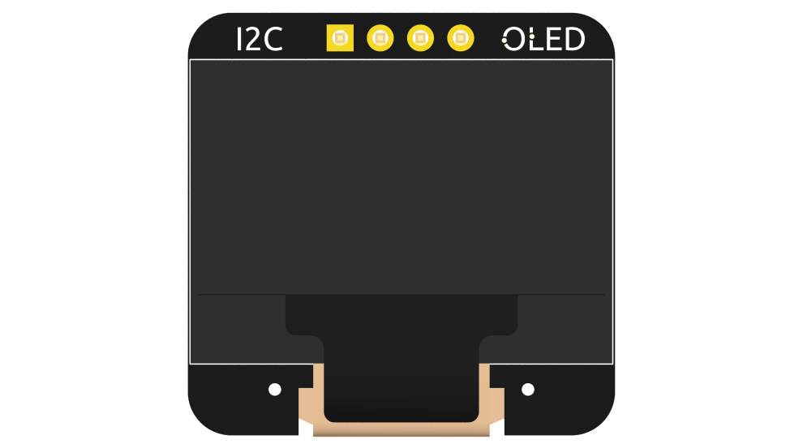
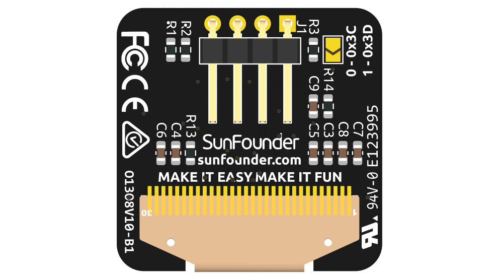
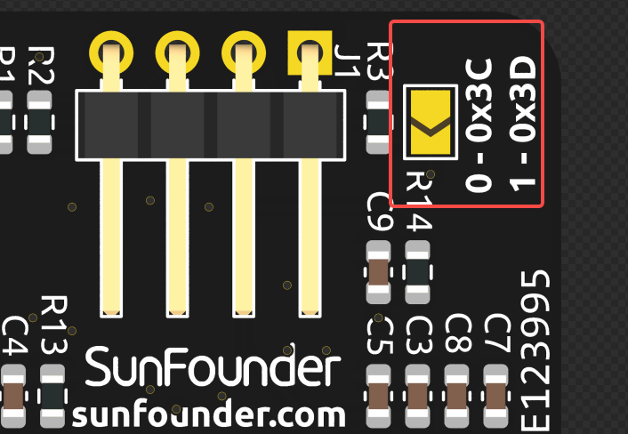

.. note::

    Hello, welcome to the SunFounder Raspberry Pi & Arduino & ESP32 Enthusiasts Community on Facebook! Dive deeper into Raspberry Pi, Arduino, and ESP32 with fellow enthusiasts.

    **Why Join?**

    - **Expert Support**: Solve post-sale issues and technical challenges with help from our community and team.
    - **Learn & Share**: Exchange tips and tutorials to enhance your skills.
    - **Exclusive Previews**: Get early access to new product announcements and sneak peeks.
    - **Special Discounts**: Enjoy exclusive discounts on our newest products.
    - **Festive Promotions and Giveaways**: Take part in giveaways and holiday promotions.

    👉 Ready to explore and create with us? Click [|link_sf_facebook|] and join today!

OLED Screen
===================

The OLED module can be directly fixed on the Piroman5 NAS via 4-pin pins.

* **Size**: 0.96''
* **Material**: PM OLED
* **Color**: White light
* **Driver**: SSD1306
* **Voltage**: 3.3V
* **Resolution**: 128*64
* **Display Area**: 21.74x10.86mm
* **Panel Size**: 26.70x19.26x1.42mm
* **Pixel Pitch**: 0.17x0.17mm
* **Pixel Size**: 0.154x0.154mm
* **Viewing Angle**: Full view
* **Operating Temperature**: -20~70°C
* **Communication Method**: IIC
* **Address**: 0x3C or 0x3D

Connect the pads on the back and the address will change from 0x3C to 0x3D.

