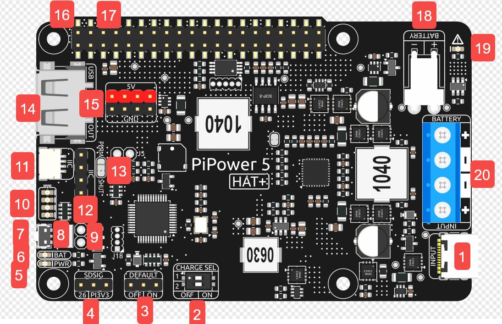

.. note::

    Hello, welcome to the SunFounder Raspberry Pi & Arduino & ESP32 Enthusiasts Community on Facebook! Dive deeper into Raspberry Pi, Arduino, and ESP32 with fellow enthusiasts.

    **Why Join?**

    - **Expert Support**: Solve post-sale issues and technical challenges with help from our community and team.
    - **Learn & Share**: Exchange tips and tutorials to enhance your skills.
    - **Exclusive Previews**: Get early access to new product announcements and sneak peeks.
    - **Special Discounts**: Enjoy exclusive discounts on our newest products.
    - **Festive Promotions and Giveaways**: Take part in giveaways and holiday promotions.

    👉 Ready to explore and create with us? Click [|link_sf_facebook|] and join today!

PiPower5 
=========================

PiPower5 is a complete UPS solution and also the core component of the Pironman 5 UPS.

It features power path management, charging and discharging of 2-cell lithium batteries, reverse battery protection, overcharge protection, over-discharge protection, and more. With a 5V/5A output and HAT+ configuration, it is perfectly compatible with Raspberry Pi 5.  
Additionally, the extra USB Type-A output and 2x4P header power output make it suitable for other SBCs such as Arduino, Pico, and ESP32.  
The onboard microcontroller manages power on/off functions and communicates via I²C to provide information such as input voltage, output voltage, battery voltage, battery capacity, external power status, charging status, and whether the current power source is the battery or USB.

**Hardware Interfaces & Indicators**

Below is a detailed description of all key interfaces, indicators, and controls available on the PiPower5 UPS module:

1. **USB Type-C Power Input**  

   - External power input for supplying the Raspberry Pi and charging the battery simultaneously.  
   - Supports **USB Power Delivery (PD) protocol**, input range **5V–15V**.

2. **Power Input Selector (DIP Switch)**  

   - Allows selection of different input power profiles for flexible configuration.

3. **Default ON Jumper**  

   - Defines whether the system should automatically power on when external power is connected while the device is shut down.  
   - ON = Auto power-on enabled, OFF = Manual start required.

4. **SDSIG (Shutdown Signal)**  

   - Provides shutdown detection for Raspberry Pi.  
   - When bridged to **PI3V3**, it works with Raspberry Pi 4 and Pi 5.  
   - When shorted to **Pin 26**, it supports Pi 3 and Pi Zero.  
   - After proper configuration, PiPower5 will cut power automatically once the Raspberry Pi shuts down.

5. **PWR LED (Output Status Indicator)**  

   - Lights up when the system output is active.

6. **BAT LED (Battery Status Indicator)**  

   - Lights up when the system is powered by the battery.  
   - A reminder to monitor battery consumption when running without external power.

7. **Power Button**  

   - **Single press**: Enable output power.  
   - **Long press (2 seconds)**: Sends a safe shutdown request via I²C.  
   - **Long press (5 seconds)**: Forces an immediate power-off (hard shutdown).  
   - **Customizable**: Single and double-press actions can be reconfigured by software.

8. **External Power Button Terminal (ZH1.5 2P)**  

   - Allows connection of an external physical power button.

9. **External Power Button Header (2.54mm)**  

   - An alternative solderable header option for external power button connection.

10. **Battery Indicator LEDs**  

    - Display remaining battery capacity and charging status.  
    - Note: Even when the system is off, LEDs remain active during charging until the battery is fully charged.

11. **I²C Interface (SH1.0 4P)**  

    - Compatible with **Qwiic** and **STEMMA QT** ecosystems.  
    - Used for communication with the onboard microcontroller and external peripherals.

12. **I²C Interface (1x4P 2.54mm Header)**  

    - Alternative I²C breakout with **3V3 power output**, configurable as always-on or switched.

13. **I²C Power Selection Jumper**  

    - **PERM**: 3V3 power is always on when external power is connected.  
    - **SHUT (default)**: 3V3 power cuts off automatically when the system shuts down.

14. **USB Type-A Output Port**  

    - Provides **regulated 5V output**, suitable for powering peripherals or other devices.

15. **2x4P 2.54mm Power Output Header**  

    - Additional 5V output for external modules or SBCs.

16. **Raspberry Pi GPIO Header (Female Connector)**  

    - Direct interface for Raspberry Pi, passing through power, I²C, and other signals.  
    - Fully compatible with Raspberry Pi pinout.

17. **Raspberry Pi GPIO Header (Male Pin Breakout)** 

    - Brings Raspberry Pi GPIO pins out for stacking HATs or external expansion.  
    - **Note**: I²C lines and Pin 26 are already occupied by PiPower5 functions.
    - You can also connect a GPIO extension cable (from the bottom of the side panel) to experiment on a breadboard.

18. **Battery Connector (XH2.54 3P)**  

    - Battery connection interface.  
    - Pin order (left to right): Negative, Mid-point (between two cells), Positive.  
    - Designed for **7.4V (2-cell) Li-ion/LiPo batteries**.

19. **Reverse Battery Warning LEDs**  

    - Two red LEDs light up if the battery is connected in reverse polarity, warning of incorrect installation.

20. **Screw Terminals for Battery & Input Power**  

    - Alternative connection method for external batteries and power sources.  
    - Supports **5V–15V external input** (recommended: >9V).  
    - Battery support: **2 x 3.7V Li-ion / LiPo cells only** (NOT compatible with LiFePO₄ batteries).  

--------------------------------------------

**Features**

* **Input**: 5-15V, 45W, USB Type-C PD, DC5.5-2.1
* **Output**: 5V/5A via Raspberry Pi GPIO, USB Type-A, and 2x4P 2.54mm pin headers
* **Charging Power**: Up to 20W
* **Battery Specs**: 7.4V 2 Cell 18650 Li-ion, XH2.54 3P connector
* **Configurable Settings via Jumpers**:

  * Default On Jumper: Configure whether the device powers on automatically when connected to power.
  * Shutdown Signal Jumper: Enable detection of the device's shutdown status.
  * External Power Button Pin Header: Connect an external power button for manual power control.

* **Onboard Indicators and Buttons**:
  
  * Battery status indicator
  * Input source indicator
  * Power button
  * Battery reverse connection indicator
  * Output power indicator

* **Onboard Microcontroller**: 32-bit ARM Cortex-M23, supporting I2C communication

* **I2C communication interfaces**: 
  
  * Raspberry Pi GPIO
  * SH1.0 4P (compatible with Qwiic and STEMMA QT)
  * 1x4P 2.54mm pin header

--------------------------------------------

**Charge Select**

By default, PiPower5 sets charging power to **5W**.

You can adjust the charging power using the **Charge SEL** dip switches. Switches 1 and 2 are both set to OFF by default.  
Use the table below to configure the charging power:

.. list-table::

   * - 1
     - OFF
     - ON
     - OFF
     - ON
   * - 2
     - OFF
     - OFF
     - ON
     - ON
   * - Charge SEL
     - 5W
     - 10W
     - 15W
     - 20W

**How to choose the charging power**

The formula is:

*Power supply capacity = Raspberry Pi required power + Charging power*

We recommend estimating the Raspberry Pi’s power requirement at **20W to 25W**.

- If you use a **30W power supply**, set charging power to **10W** or **5W**.  
- If you use a **45W power supply**, you can safely set charging power to **20W**.  

If you are familiar with your Raspberry Pi’s power needs, you may set a higher charging power as long as you reserve enough margin for occasional power spikes.  
⚠️ Be cautious: insufficient power may cause the Raspberry Pi to shut down unexpectedly.

