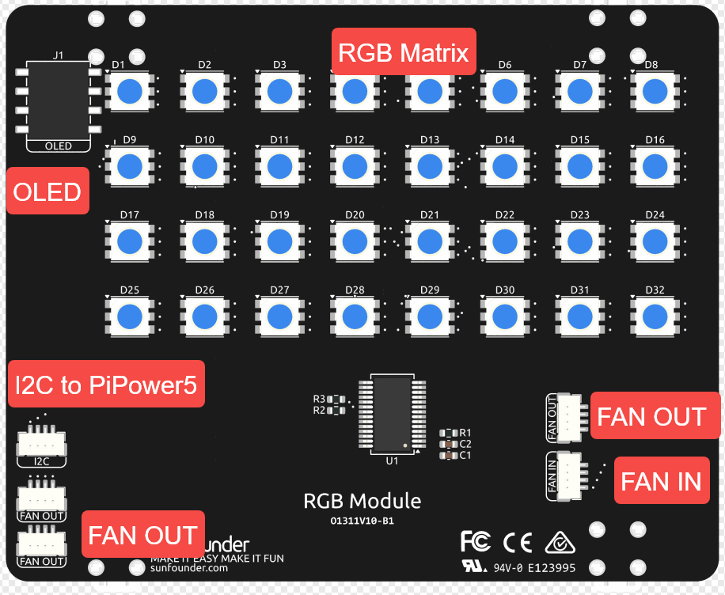

.. note::

    Hello, welcome to the SunFounder Raspberry Pi & Arduino & ESP32 Enthusiasts Community on Facebook! Dive deeper into Raspberry Pi, Arduino, and ESP32 with fellow enthusiasts.

    **Why Join?**

    - **Expert Support**: Solve post-sale issues and technical challenges with help from our community and team.
    - **Learn & Share**: Exchange tips and tutorials to enhance your skills.
    - **Exclusive Previews**: Get early access to new product announcements and sneak peeks.
    - **Special Discounts**: Enjoy exclusive discounts on our newest products.
    - **Festive Promotions and Giveaways**: Take part in giveaways and holiday promotions.

    👉 Ready to explore and create with us? Click [|link_sf_facebook|] and join today!

RGB Module
======================

The **RGB MODULE** is a versatile lighting and control expansion unit designed for the Raspberry Pi case.  
It integrates vibrant RGB lighting with cooling and display connectivity, enhancing both functionality and aesthetics.

* **RGB Lighting Array**

  * Equipped with a **4 x 8 matrix** of RGB LEDs (total **32 LEDs**).
  * Provides lighting effects for visual feedback and case illumination.

* **OLED Interface**

  * Dedicated **OLED connector** for attaching the official OLED display of this product.
  * Enables real-time system information display such as temperature, CPU usage, etc.

* **Fan Control**

  * **FAN IN Connector**: Connects directly to the Raspberry Pi’s fan control interface, enabling dynamic fan speed regulation.

  * **FAN OUT Connectors (x3)**:

    * **1 port** for controlling the **Active Cooler**.
    * **2 ports** for additional Supplementary **Fans**.
    * All **FAN OUT ports are connected in parallel**, ensuring synchronized operation across multiple fans.
