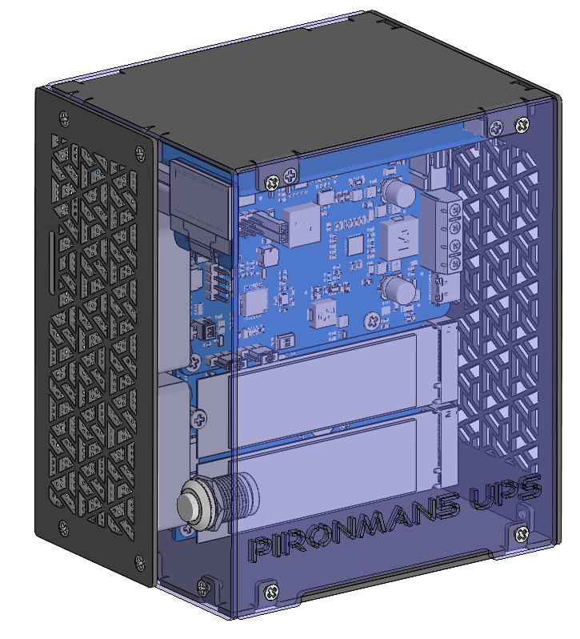

.. note::

    Hello, welcome to the SunFounder Raspberry Pi & Arduino & ESP32 Enthusiasts Community on Facebook! Dive deeper into Raspberry Pi, Arduino, and ESP32 with fellow enthusiasts.

    **Why Join?**

    - **Expert Support**: Solve post-sale issues and technical challenges with help from our community and team.
    - **Learn & Share**: Exchange tips and tutorials to enhance your skills.
    - **Exclusive Previews**: Get early access to new product announcements and sneak peeks.
    - **Special Discounts**: Enjoy exclusive discounts on our newest products.
    - **Festive Promotions and Giveaways**: Take part in giveaways and holiday promotions.

    👉 Ready to explore and create with us? Click [|link_sf_facebook|] and join today!

Pironman 5 UPS
================================================================================

**Pironman 5 UPS Overview**

The **Pironman 5 UPS** is the latest addition to the Pironman Raspberry Pi case series, purpose-built for the new Raspberry Pi 5.  
It integrates the **PiPower5 module** with a full **Uninterruptible Power Supply (UPS)** system, providing reliable protection against unstable input power and unexpected outages to ensure continuous operation.

Equipped with a built-in **7.4V 2000mAh lithium battery**, the Pironman 5 UPS delivers up to **5V/5A output power** and supports **20W fast charging**.  
Beyond power security, it also incorporates advanced system features, including:

- **Active Cooling**: Three high-efficiency fans for effective thermal management.  
- **Visual Monitoring**: An onboard OLED display for real-time system information.  
- **Lighting Effects**: A 4x8 **RGB LED matrix** for customizable illumination.  
- **High-Speed Expansion**: Dual **PCIe Gen2 x1 M.2 M-key slots** for NVMe SSDs, AI accelerators, or other compatible PCIe devices.  

With its combination of power redundancy, thermal control, system monitoring, and expansion flexibility, the Pironman 5 UPS is designed to transform the Raspberry Pi 5 into a stable, powerful, and versatile workstation-class platform.

If you have any questions, please send an email to service@sunfounder.com and we will respond as soon as possible.

.. raw:: html

    

.. toctree::
    :maxdepth: 1

    About this Kit <self>
    what_do_we_need    
    assembly_instructions
    install/install_the_os
    set_up/set_up_pironman5
    control/control_pironman5
    hardware/hardware
    power_safe_function
    home_server/home_server
    faq

**Parameters**

* Dimension: 108 x 87 x 125mm
* Material
    * Main body: aluminum alloy
    * Side panel: acrylic
* Support Platform: Raspberry Pi 5
* Power Input：5-15V，45W Max，USB Type C PD or Screw Terminal
* Dual M.2 M key PCIe Gen 2 x 1
* Power for Raspberry Pi: 5V/5A
* Charge Power：5/10/15/20W optional
* USB：USB 3.0 x2, USB 2.0 x2 from Raspberry Pi
* Video: Dual 4Kp60 HDMI Type A display output from Raspberry Pi
* Display: 0.96'' 128x64 OLED Display
* Heat dissipation：CPU Fan + 2xFront Fan
* RGB：4x8 RGB Matrix
* Battery specifications: 7.4V 2000mAh, 2-cell 18650 Li-ion, VH2.54 2P connector
* Default On jumper to select whether to power on the device
* Power switch
* RTC 1220 battery holder
* Raspberry Pi 40P GPIO

**Copyright Notice**

All contents including but not limited to texts, images, and code in this manual are owned by the SunFounder Company. You should only use it for personal study,investigation, enjoyment, or other non-commercial or nonprofit purposes, under therelated regulations and copyrights laws, without infringing the legal rights of the author and relevant right holders. For any individual or organization that uses these for commercial profit without permission, the Company reserves the right to take legal action.

